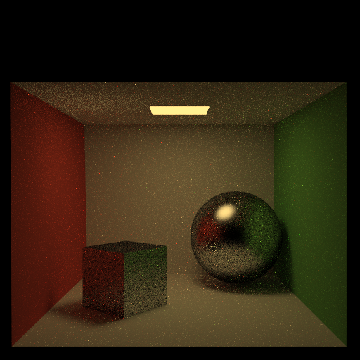

## Pathtracer README

### Output Comparison

| `.ini` File To Produce Output | Expected Output | My Code's Output |
| :---------------------------------------: | :--------------------------------------------------: | :-------------------------------------------------: |
| cornell_box_full_lighting.ini |   |  |
| cornell_box_direct_lighting_only.ini |   |  |
| cornell_box_full_lighting_low_probability.ini |   |  |
| mirror.ini |   |  |
| glossy.ini |   |  |
| refraction.ini |   |  |

> Note: The reference images above were produced using the [Extended Reinhard](https://64.github.io/tonemapping/#extended-reinhard) tone mapping function with minor gamma correction. You may choose to use another mapping function or omit gamma correction.

### Design Choices
My path tracer implements all the required features listed in README.md, with the BRDF functions, Hemisphere Sampling Function, and Direct Lighting Integral function abstracted out into separate functions from the main Radiance `traceRay` function. The implementation is structured with the following key components modularized for clarity and extensibility:

- **BRDF Models**: The diffuse, glossy specular, and mirror reflection models are implemented separately to allow reuasbility of these models. The `diffuseBRDF()`, `glossyBRDF()`, and `mirrorBRDF()` functions define these reflectance models. **Refraction with Fresnel Reflection BRDF** is implemented implicitly in the `traceRay` function.
- **Sampling Strategies**: I implemented multiple sampling techniques for rendering efficiency:
  - Uniform hemisphere sampling (`sampleNextDirection()`).
  - Importance sampling for diffuse surfaces (`cosineWeightedSample()`).
  - Importance sampling for glossy materials (`cosinePowerNWeightedSample()`).
- **Direct Lighting Computation**: Direct lighting is calculated via Monte Carlo Integration (`directL()`), iterating over emissive triangles and sampling their light contributions. **Soft Shadows** are implemented from sampling these area light sources.
- **Indirect Lighting Computation**: Indirect Lighting is also calculated via Monte Carlo Integration implemented with `tracePixel()` and `traceRay()`, sampling over the hemisphere for incoming light contributions for a given intersection point in the scene.
- **Path Tracing Core**: The `traceRay()` function implements recursive path tracing, handling both direct and indirect lighting. The countEmitted parameter for `traceRay` is used to account for **Event Splitting**, which prevent double-counting as light transport is split between direct and indirect integral. Additionally, it includes:
  - **Russian Roulette Path Termination**: A probability-based early termination strategy for unbiased rendering.

For **Tone Mapping**, I implemented the **Extended Reinhard** operator with gamma correction. If you like white light, you can replace the call to `reinhard` with `extendedReinhard` in `pathtracer.cpp`'s `toneMap` function which will preserve the white light, but if you like this warm yellow light, you can just use `reinhard` in `toneMap`. The final tone mapping function applies a `gamma = 1/2.2` correction.

All of my output images already have Importance Sampling applied. I used setting flags `isImportance`, `isAttenuate`, `isStratifiedSampling` and `isLowDiscrepancySampling` to toggle between the basic and extra features.

### Extra Features
I implemented these 5 Extra Features:
1. **Importance Sampling for Glossy Specular BRDF**
2. **Importance Sampling for Diffuse BRDF**
3. **Attenuating Refracted Light**
4. **Low Discrepancy Sampling**
5. **Stratified Sampling**

#### **1. Importance Sampling for Glossy Specular BRDF**
**Before Image: `glossy_uniform.ini`**  
**After Image: `glossy.ini`**  
Implementation:  Instead of using uniform sampling for glossy reflections, I implemented importance sampling by generating reflection directions based on a cosine-power-n-weighted distribution centered around the perfect mirror reflection direction. This was implemented in the function `cosinePowerNWeightedSample()`, where the reflection direction `wo_refl` was computed, and a sample was drawn with probability proportional to `cos^n(theta)`. This focuses more samples in the specular lobe.

What Each Image Demonstrates:  The left is Indirect Lighting Only + Uniform Hemisphere Sampling, the right image is Indirect Lighting Only + cos^n(theta) Weighted Hemisphere Sampling for Glossy BRDF. 
**NOTE: I purposely choose to omit Direct Light in this specific render for the purpose of demonstration. With only indirect lighting, we can better see the stark difference that importance sampling can make compared to uniform sampling. You can toggle whether a scenefile has direct lighting by setting `hasDirectLighting = false` in the `.ini` file; hasDirectLighting value is default set to true in the PathTracer class.**

| Before - Indirect Lighting Only + Uniform Sampling | After - Indirect Lighting Only + Importance Sampling :) |
|--------|--------------------------------------|
|  |  |

#### **2. Importance Sampling for Diffuse BRDF**
**Before Image: `cornell_box_uniform.ini`**  
**After Image: `cornell_box_full_lighting.ini`**  
Implementation: Instead of uniformly sampling hemisphere directions, I implemented importance sampling for the diffuse BRDF by weighting the sampling distribution using `cos(theta)`. This was implemented in `cosineWeightedSample()`, where random samples were drawn with a probability proportional to `cos(theta)`, ensuring that more samples are taken in directions contributing more to the final radiance. This reduces noise as the p(x) function matches the shape of the f(x) function more in the Monte Carlo Estimator for radiance.

What Each Image Demonstrates: The left is Indirect Lighting Only + Uniform Hemisphere Sampling, the right image is Indirect Lighting Only + cos(theta) Weighted Hemisphere Sampling for Diffuse BRDF. 
**NOTE: I purposely choose to omit Direct Light in this specific render for the purpose of demonstration. With only indirect lighting, we can better see the stark difference that importance sampling can make compared to uniform sampling. You can toggle whether a scenefile has direct lighting by setting `hasDirectLighting = false` in the `.ini` file; hasDirectLighting value is default set to true in the PathTracer class.**

| Before - Indirect Lighting Only + Uniform Sampling | After Indirect Lighting Only + Importance Sampling :) |
|--------|--------------------------------------|
|  |  |

#### **3. Attenuating Refracted Light for Dielectric Refraction BRDF**
**Before Image: `refraction.ini`**  
**After Image: `refraction_attenuation.ini`**  
Implementation: I added attenuation for refracted rays to simulate the gradual absorption of light in dielectric materials. This was implemented in the refraction computation inside `traceRay()`, where the transmitted ray's intensity was attenuated based on its distance traveled inside the medium,. The attenuation factor was computed as `1.0 / (1.0 + dist + dist^2)`, where `dist` is the distance the refracted ray travels before hitting another surface, computed by taking the norm from the hit point i.hit and a recursive getIntersection hit point in the direction of the refracted omega, i2.hit.

What Each Image Demonstrates: 

| Before | After Incorporating Extra Feature :) |
|--------|--------------------------------------|
|  |  |

#### **4. Low Discrepancy Sampling**
**Before Image: `cornell_box_full_lighting.ini`**  
**After Image: `cornell_box_low_discrepancy.ini`**  
Implementation: I implemented low discrepancy sampling using the Halton sequence to generate sample points in a less random but more evenly distributed manner. This was done in `traceLowDiscrep()`, where sample positions were determined using `haltonSequence()`, which generates quasi-random numbers that are more evenly spaced compared to pure random sampling.

What Each Image Demonstrates:

| Before | After Incorporating Extra Feature :) |
|--------|--------------------------------------|
|  |  |

#### **5. Stratified Sampling**
**Before Image: `cornell_box_full_lighting.ini`**  
**After Image: `cornell_box_stratified.ini`**  
Implementation: I divided the sampling domain into a grid using stratified sampling to ensure that each sub-region of the pixel gets sampled. This was implemented in `traceStratified()`, where I divided the pixel into `sqrt(samples)` strata and placed a random sample within each, rather than allowing clusters of random samples in one region. This ensures better coverage of the pixel area and reduces noise in the final image.

What Each Image Demonstrates:

| Before | After Incorporating Extra Feature :) |
|--------|--------------------------------------|
|  |  |

### Collaboration/References
- For tone mapping, I used https://64.github.io/tonemapping/#extended-reinhard. 

### Known Bugs
There are no known bugs.

